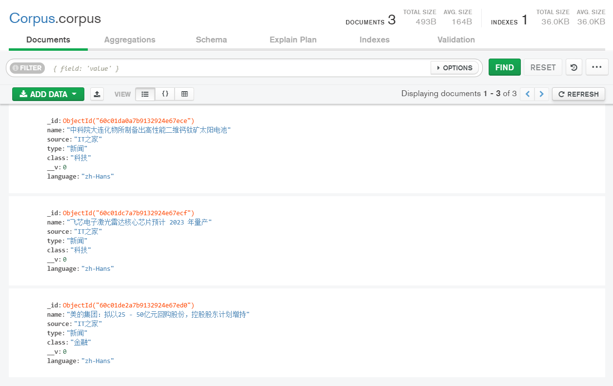
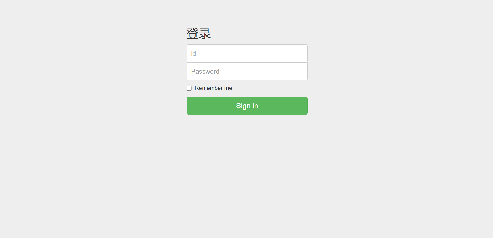
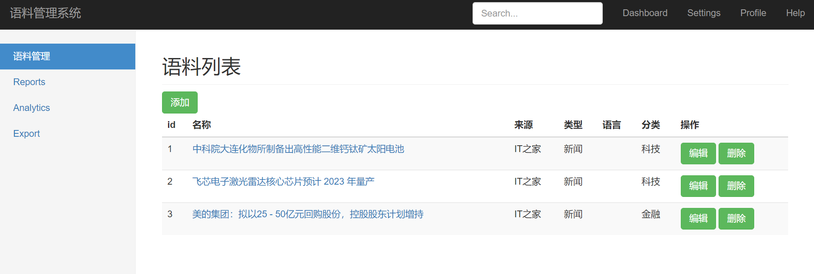

date: 2021-05-29 10:33:06

Node.js作业，语料管理系统（学生管理系统更合适，老师让叫这个），使用express框架 + bootstrap + MongoDB，实现对信息的增删改查，虽然还有不足之处，但交作业肯定没问题😀

## 运行

```
// 安装依赖
npm install

// 运行
node app
```

## 文件描述

- login.js -- 登录模块
- CorpusData.js -- 连接MongoDB数据库
- Corpus.js -- （**可弃用**）封装方法对JSON文件进行CRUD操作（database/db.json）

**view文件夹**

- Corpus.html -- 管理员页面

- CorpusUser.html -- 普通用户页面

- login.html -- 登录页面

- new.html -- 添加信息页面

- edit.html -- 编辑信息页面

## 路由设计

- /Corpus/login 登录页面

- /Corpus 管理员页面

- /CorpusUser 普通用户页面

- /Corpus/new 添加信息

- /Corpus/edit 编辑信息

- /Corpus/delete 删除信息

## 用户信息

- root用户 -- id: root    密码: 123456
- 普通用户 -- id: 123     密码：123456

## 数据库信息

database/corpus.json -- 导出的数据库文件



## 页面展示 

登录页面



普通用户界面


root用户界面


